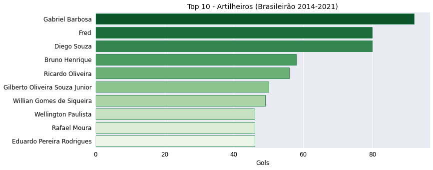

# Brasileirão 2021 (EDA)


Neste projeto, apresento detalhadamente uma análise exploratória e explanatória de um dataset do Brasileirão 2021, com o uso programático da linguagem Python em junção com a biblioteca Pandas para manipulação de dados, e também com o auxílio das bibliotecas Matplotlib e Seaborn para visualização gráfica dos dados informacionais. 

## Importação de Bibliotecas

```
import pandas as pd
import numpy as np
import matplotlib.pyplot as plt
import seaborn as sns

```

## Fonte de dados

O dataset [Campeonato Brasileiro de futebol](https://www.kaggle.com/datasets/adaoduque/campeonato-brasileiro-de-futebol) utilizado em tal análise exploratória está hospedado disponivelmente no Kaggle para uso gratuito.

## Importação do Dataset 

Duas bases de dados foram importadas, uma em relação aos jogos, times e placares dos jogos do Brasileirão registrados de 2003 até 2021, e a segunda base de dados é concernente às estatísticas gerais e técnicas de todos os jogos registrados em cada campeonato.

```
df = pd.read_csv('/content/drive/MyDrive/campeonato-brasileiro-full.csv')
```

```
df_2 = pd.read_csv('/content/drive/MyDrive/campeonato-brasileiro-estatisticas-full.csv', sep = ',')
```

## Colunas de cada dataset

Colunas do dataset de jogos do campeonato brasileiro:

```
'ID', 'rodada', 'data', 'hora', 'dia', 'mandante', 'visitante',
       'formacao_mandante', 'formacao_visitante', 'tecnico_mandante',
       'tecnico_visitante', 'vencedor', 'arena', 'mandante_placar',
       'visitante_placar', 'mandante_estado', 'visitante_estado',
       'estado_vencedor', 'ano_brasileirao', 'gols_na_partida'
```

Colunas do dataset de estatísticas de jogos do campeonato brasileiro:

```
'partida_id', 'rodada', 'clube', 'chutes', 'chutes_no_alvo',
       'posse_de_bola', 'passes', 'precisao_passes', 'faltas',
       'cartao_amarelo', 'cartao_vermelho', 'impedimentos', 'escanteios'
```
## Processo de exploração dos dados

### **(1)** Tratamento dos dados

* Tipo dos dados:
  
  **(1)** A coluna relativa às datas dos jogos foi conversível de tipo object (ou texto) para tipo datetime, que é o tipo de dados mais apropriado condizentemente à informações de datas e horários.
  
  **(2)** As colunas relativas às estatísticas do Brasileirão foram conversíveis de tipo object (ou texto) para tipo float, por serem colunas que informavam a porcentagem de posse de bola e precisão no passe dos times em cada jogo do campeonato, e como porcentagem é um tipo de dado numérico, então o tipo float é o tipo de dado mais adequado e correspondente com os dados de ambas às colunas.
  
* Filtragem dos dados:
  
  **(1)** A coluna de data dos jogos foi convertida de object para datetime para que pudessémos com mais facilidade, filtrarmos os jogos ocorrentes somente no Brasileirão 2021, porém havia jogos do ano de 2021 que eram jogos da edição passada (2020), então filtramos os jogos de 2021 à partir do mês de inicialização do Brasileirão 2021, ou seja, filtramos os dados à partir do mês de Maio de 2021.
  
  ```
  df_br_21 = df[(df['data'].dt.year == 2021) & (df['data'].dt.month.isin([5, 6, 7, 8, 9, 10, 11, 12]))]
  ```
 
  **(2)** No dataset de estatísticas filtramos os dados relativos ao Brasileirão de 2021 pela coluna partida_id, analisamos o intervalo de id's das partidas ocorrentes no Brasileirão 2021 para podermos ter somente os dados estatísticos relativos aos jogos do Brasileirão 2021.
  
  ```
  df_br_est_21 = df_2.loc[(df_2['partida_id'] >=  7266) & (df_2['partida_id'] <= 7645)]
  ```
  
* Renomeação de coluna:

  **(1)** Renomeamos as colunas de precisão do passe e posse de bola para inserirmos um sinal de porcentagem que indique explicitamente que tais colunas informam dados percentuais.
  
  **(2)** Mudamos o nome das colunas de 'mandante' e 'visitante' para 'time_mandante' e 'time_visitante' para deixar o título das colunas o mais específico e explícito possível para que a informação seja entendida.
  
  **(3)** Depois disto, durante o restante da análise exploratória, mudamos os nomes das colunas em agrupamentos e em várias manipulações para podermos ter nomes de colunas com nomes mais condizentes com suas informações expressas.
  
* Criação de coluna:

  **(1)** Criamos uma coluna que some os dados numéricos da coluna de gols do time mandante em junção com os gols do time visitante, tal coluna criada expressa a quantidade de gols totais em cada partida do Brasileirão 2021.
  
  ```
  df_br_21['gols_na_partida'] = df_br_21['mandante_placar'] + df_br_21['visitante_placar']
  ```
  
* Formatação de colunas:
  
  **(1)** A coluna 'arena' foi formatada textualmente de letras minúsculas para o tipo textual de título com letras maiúsculas no início do nome de cada arena em que os jogos do Brasileirão foram ocorrentes em 2021.
  
  **(2)** As colunas de times, arenas e dias dos jogos foram formatadas para um tipo textual mais correto ortograficamente.
    
### **(2)** Conhecimento exploratório dos dados

Nesta fase, os dados do Brasileirão 2021 começaram à ser explorados para que novas informações fossem extraídas de tal base de dados, primeiramente aplicamos o método .cumsum() para obtermos a soma cumulativa de gols por partida no Brasileirão 2021, e por fim obtivemos o resultado 842, que em outras palavras significa que 842 gols foram marcados no Brasileirão 2021 como um todo.

À partir de tal informação, nos perguntamos:

#### **(1)** Quais foram às edições do campeonato brasileiro que tiveram mais gols contabilizados em todo o torneio?

Para responder tal questão, agrupamos os anos de cada Brasileirão e contabilizamos a quantidade de gols que foram marcados em cada edição anual do campeonato brasileiro, e assim obtivemos este resultado:

| index | ano  | qtd_de_gols |   |
|-------|------|-------------|---|
| 0     | 2003 | 1592        |   |
| 1     | 2004 | 1534        |   |
| 2     | 2005 | 1451        |   |
| 3     | 2006 | 1030        |   |
| 4     | 2007 | 1047        |   |
| 5     | 2008 | 1035        |   |
| 6     | 2009 | 1094        |   |
| 7     | 2010 | 978         |   |
| 8     | 2011 | 1017        |   |
| 9     | 2012 | 940         |   |
| 10    | 2013 | 936         |   |
| 11    | 2014 | 860         |   |
| 12    | 2015 | 897         |   |
| 13    | 2016 | 912         |   |
| 14    | 2017 | 923         |   |
| 15    | 2018 | 827         |   |
| 16    | 2019 | 876         |   |
| 17    | 2020 | 944         |   |
| 18    | 2021 | 842         |   |
|       |      |             |   |
 
A tabela acima está organizada em ordem crescente cronologicamente, isto é, do menor ano até o maior ano em que os gols totais de cada torneio foram ordenados.

Após isto, ordenamos às cinco edições do Brasileirão que mais gols foram marcados durante todo o campeonato:

|           index |              ano | total_de_gols |
|-----------------|------------------|---------------|
| 0               | 2003             | 1592          |
| 1               | 2004             | 1534          |
| 2               | 2005             | 1451          |
| 6               | 2009             | 1094          |
| 4               | 2007             | 1047          |

Curiosamente, os torneios da década de 2000 foram os anos em que o campeonato brasileiro teve edições com o maior número de gols marcados, 2003, 2004 e 2005 consecutivamente foram os anos com mais gols marcados em um campeonato brasileiro, à partir desses anos em diante o campeonato brasileiro teve gols marcados abaixo de tais edições.

Inversamente, ordenamos também as edições do Brasileirão que tiveram menos gols contabilizados em todo o campeonato:

|           index |                   ano | total_de_gols |
|-----------------|-----------------------|---------------|
| 15              | 2018                  | 827           |
| 18              | 2021                  | 842           |
| 11              | 2014                  | 860           |
| 16              | 2019                  | 876           |
| 12              | 2015                  | 897           |

Às edições mais recentes do Brasileirão de 2018, 2019 e 2021 são uma das edições registradas com o menor número de gols marcados em todo o campeonato.

Após tal exposição, poderemos apresentar um gráfico de colunas para representar a quantidade de gols marcados em cada edição anual do Brasileirão:


Um gráfico de pizza seria útil para representar proporcionalmente a quantidade de gols marcados em cada ano do Brasileirão em relação a quantidade de gols marcados durante todos os Brasileirões de 2003 até 2021.


Em suma, o gráfico de pizza expressa informacionalmente que do total de gols marcados em todos os Brasileirões de 2003 até 2021, aproximadamente 8% desses gols foram marcados nos anos de 2003, e de 100% do total de gols de todos os Brasileirões, 23% representa a quantidade de gols marcados nos anos entre 2003 e 2005, ou seja, quase 1 / 4 dos gols de todos os Brasileirões foi marcado em tal intervalo entre 2003 e 2005.

Após termos tal noção de quais foram às edições anuais do Brasileirão com mais gols contabilizados, podemos inicializar a análise restrita exclusivamente ao Brasileirão 2021.

#### **(2)** Quais foram os times com mais vitórias registradas no Brasileirão 2021?

Basicamente, antes de respondermos tal pergunta, poderemos classificar quais foram os times participantes do Brasileirão 2021 da série A:

```
'Atlético-MG',
 'Flamengo',
 'Palmeiras',
 'Fortaleza',
 'Fluminense',
 'Corinthians',
 'Bragantino',
 'Athletico-PR',
 'Atlético-GO',
 'América-MG',
 'Santos',
 'Internacional',
 'Grêmio',
 'Bahia',
 'Ceará',
 'Juventude',
 'São Paulo',
 'Cuiabá',
 'Sport',
 'Chapecoense'
 ```
Entre todos os times escritos acima, temos um gráfico de barras horizontais para expressar em ordem decrescente os times com mais vitórias até os times com menos vitórias contabilizadas em todo o Brasileirão 2021:


Pelo gráfico de barras horizontais acima é observável conspicuamente que os cinco (ou seis) times que mais contabilizaram vitórias foram o Atlético Mineiro, Flamengo, Palmeiras, Fortaleza, e por fim Fluminense e Corinthians empatados.

Disto, poderemos ter dois gráficos de colunas para expressar ordenadamente os 4 times com mais vitórias contabilizadas em constraste aos times com menos vitórias contabilizadas em todo o campeonato.


O time campeão do Brasileirão 2021 foi o Atlético Mineiro e intuitivamente é expectante que este tenha sido o time com mais vitórias no campeonato todo, o Flamengo foi o vice-campeão, o Palmeiras teve o término em terceiro lugar e o Fortaleza em quarto lugar na tabela do Brasileirão 2021.

Em outras palavras, como esperado os times com mais vitórias no campeonato foram os times que concluíram o campeonato no G4.

No entanto, inesperadamente os únicos times dos quatro times com menos vitórias que foram rebaixados para a série B foram o Sport e o Chapecoense.

Disto há como afirmarmos que caso um time seja um dos times com menos vitórias no campeonato brasileiro, isso não implica necessariamente que tal time será rebaixado, como neste caso o Grêmio teve mais vitórias do que o São Paulo e o Bahia teve mais vitórias que o Cuiabá no Brasileirão 2021. 

No entanto, o Grêmio e o Bahia foram rebaixados, enquanto o São Paulo e o Cuiabá, não.

À partir do insight de quais foram os times que terminaram no G4 e contabilizaram mais vitórias no campeonato, poderemos nos perguntar:

#### **(3)** Os times com mais vitórias no Brasileirão 2021, tiveram mais vitórias contabilizadas 'dentro' ou 'fora' de casa?

Primeiro, temos uma tabela para expressar a quantidade de vitórias contabilizadas dos times do G4 em jogos que tais times jogaram 'dentro' de casa: 

| index | time_mandante |     qtd_vitorias |
|-------|---------------|------------------|
| 3     | Atletico-MG   | 17               |
| 9     | Flamengo      | 13               |
| 10    | Fluminense    | 11               |
| 15    | Palmeiras     | 11               |
| 11    | Fortaleza     | 11               |
|       |               |                  |

Segundamente, temos uma tabela para expressar a quantidade de vitórias contabilizadas dos times do G4 em jogos que tais times jogaram 'fora' de casa:

|                 index | time_visitante |   qtd_vitorias |
|-----------------------|----------------|----------------|
| 3                     | Atlético-MG    | 9              |
| 16                    | Palmeiras      | 9              |
| 10                    | Flamengo       | 8              |
| 2                     | Atlético-GO    | 7              |
| 5                     | Bragantino     | 7              |
| 12                    | Fortaleza      | 6              |

Comparativamente, os times do G4 apresentam uma vantagem de vitórias ao jogarem 'dentro' de casa do que ao jogarem 'fora' de casa.

Como esperado o Atlético Mineiro foi o time com mais vitórias dentro e fora de casa no Brasileirão como um todo, o Palmeiras juntamente ao Atlético Mineiro foi um dos times com vitórias fora de casa também. 

Os times que terminaram no G4 da tabela do Brasileirão 2021 foram um dos times que mais contabilizaram vitórias 'dentro' e 'fora' de casa.

Entre os times com mais vitórias 'dentro' de casa que terminaram o campeonato fora do G4, temos somente o Fluminense, que foi o time que teve o término de campeonato na sétima posição do Brasileirão.

Já entre os times com mais vitórias 'fora' de casa que terminaram o campeonato fora do G4, temos o Bragantino e o Atlético-GO, em que o Bragantino teve um término de torneio próximo do G4 na sexta posição, e temos o Atlético-GO que teve o término na nona posição do campeonato.

Após respondemos a questão (2), poderemos continuar à explorar o motivo do porquê o São Paulo e o Cuiabá que foram um dos times com menos vitórias contabilizadas no Brasileirão, não foram rebaixados para à série B? Enquanto times como o Bahia e o Grêmio que foram times com mais vitórias em comparação, foram um dos quatro times rebaixados da série A para à série B.

Será que o São Paulo e o Cuiabá contabilizaram mais empates ao ponto de conseguirem superar em pontos o Bahia e o Grêmio? E será que o Bahia e o Grêmio foram um dos times com mais derrotas contabilizadas em comparação ao São Paulo e ao Cuiabá, e assim possibilitaram com que os dois times escapassem do rebaixamento pelos pontos obtidos por empates?

Bom, iremos responder tais questões nas próximas perguntas:

#### **(4)** Quais times do Brasileirão 2021 contabilizaram mais empates em todo o campeonato?

Basicamente, para responder tal pergunta usamos o .groupby() para agruparmos os times participantes do Brasileirão 2021, filtramos os jogos que foram concluídos com placares idênticos e somamos a quantidade de empates que cada time obteve em todo o campeonato.

Consequentemente, colocamos uma tabela em ordem decrescente para expressar os times que mais empataram até os times que menos empataram no Brasileirão 2021:

| index | time          | total_empates |
|-------|---------------|---------------|
| 10    | Cuiabá        | 17            |
| 4     | Ceará         | 17            |
| 1     | São Paulo     | 15            |
| 6     | Santos        | 14            |
| 9     | América-MG    | 14            |
| 0     | Atlético-GO   | 14            |
| 2     | Bragantino    | 14            |
| 7     | Juventude     | 13            |
| 8     | Internacional | 12            |
| 11    | Chapecoense   | 12            |
| 14    | Corinthians   | 12            |
| 3     | Sport         | 11            |
| 15    | Bahia         | 10            |
| 13    | Fluminense    | 9             |
| 12    | Athlético-PR  | 8             |
| 19    | Flamengo      | 8             |
| 5     | Grêmio        | 7             |
| 16    | Fortaleza     | 7             |
| 17    | Palmeiras     | 6             |
| 18    | Atlético-MG   | 6             |

Curiosamente, os times com mais vitórias contabilizadas, foram um dos times com menos empates registrados em todo o campeonato, será que tal tendência irá se manter para a quantidade de derrotas? Isto é, será que os times com mais vitórias em todo o campeonato são os times com menos derrotas contabilizadas?

Depois disto, plotamos um gráfico de barras horizontais para representar visualmente os dez times que mais empataram em todo o campeonato:


O gráfico de barras acima demonstra que o São Paulo e o Cuiabá foram um dos times que mais empataram no Brasileirão 2021 e que contabilizaram mais empates do que o Grêmio e o Bahia. 

Será que a quantidade de empates do São Paulo e do Cuiabá foram um dos fatores cruciais para que os dois times não fossem rebaixados?

#### **(4)** Quais foram os times com mais derrotas contabilizadas em todo o Brasileirão 2021?

Para respondermos a tal pergunta, realizamos o mesmo processo manipulativo para sabermos a quantidade de derrotas de cada time no Brasileirão e quais foram os times com mais derrotas contabilizadas.

| index |    time       | total_derrotas |          
|-------|---------------|----------------|
|       |               |                |
| 1     | Chapecoense   | 25             |
| 0     | Gremio        | 19             |
| 2     | Sport         | 18             |
| 3     | Bahia         | 17             |
| 4     | Athletico-PR  | 17             |
| 5     | Fluminense    | 14             |
| 6     | Juventude     | 14             |
| 7     | Fortaleza     | 14             |
| 8     | Internacional | 14             |
| 9     | Sao Paulo     | 12             |
| 11    | Santos        | 12             |
| 13    | Palmeiras     | 12             |
| 15    | Corinthians   | 11             |
| 17    | Cuiaba        | 11             |
| 10    | Atletico-GO   | 11             |
| 14    | America-MG    | 11             |
| 16    | Bragantino    | 10             |
| 12    | Ceara         | 10             |
| 19    | Flamengo      | 9              |
| 18    | Atletico-MG   | 6              |

Após isto, utilizamos o gráfico comum e simples de colunas para representarmos os dez times com mais derrotas registradas em todo o torneio:


Concluído isto, fizemos a diferença de empates e de vitórias entre São Paulo e Cuiabá em comparação ao Bahia e ao Grêmio, e descobrimos que às explicações do porquê São Paulo e Cuiabá que foram times com menos vitórias e que não foram rebaixados, em comparação ao Grêmio e ao Bahia que tiveram mais vitórias e foram rebaixados é que:

   **(1)**  O São Paulo e o Cuiabá contabilizaram mais empates no campeonato e isto os garantem um ponto em cada empate.
   
   **(2)** O Grêmio e o Sport contabilizaram mais derrotas no campeonato e isto não os garantem nenhum ponto.
   
   **(3)** A diferença de vitórias entre Grêmio e Bahia em relação ao São Paulo e Cuiabá é de uma à duas vitórias, enquanto a diferença de empates entre São Paulo e Cuiabá em relação ao Grêmio e ao Bahia é de aproximadamente 7 à 8 empates.
   
   Logo, à partir da justificação **(3)** podemos concluir que:
       
       Cuiabá -> 8 pontos. Bahia -> 3 pontos
       São Paulo -> 7 pontos. Grêmio -> 3 pontos
       Cuiabá -> 8 pontos. Grêmio -> 6 pontos.
       
Resumidamente, São Paulo e Cuiabá por terem contabilizado de 7 à 8 empates do que o Bahia e o Grêmio, conseguiram ultrapassar os pontos de vantagem de uma à duas vitórias do Bahia e do Grêmio, e justificadamente conseguiram evitar o rebaixamento para a série B. 

E também, correspondente às expectativas, Chapecoense, Grêmio, Sport e Bahia que foram os times rebaixados para a série B do Brasileirão, também foram os times com mais derrotas contabilizadas no Brasileirão 2021 como um todo.

E curiosamente, somente dois times do G4 foram um dos times com menos derrotas no campeonato, assim somente Atlético-MG e Flamengo tiveram menos derrotas no torneio, enquanto Palmeiras e Fortaleza foram times do G4 com mais derrotas comparativamente contabilizadas no campeonato.

À partir de tais informações básicas que foram obtidas podemos ir para questões mais técnicas e complexas estatisticamente, por exemplo, qual é a correlação entre gols dos times mandantes ou visitantes em relação aos gols da partida? 

Isto é, será que há uma tendência de que os times mandantes marquem mais gols na partida do que os times visitantes?

#### **(5)** Qual é a correlação de gols dos times mandantes e visitantes em relação aos gols por partida? 

Com o método .corr() obtemos que a correlação entre gols do time mandante e gols por partida é 0.75, ou seja, é uma correlação forte entre às duas variáveis, enquanto a correlação entre gols do time visitante e gols por partida é 0.69, que é uma correlação classificada como moderada pela correlação de Pearson.

Por esses dados numéricos de correlação, poderemos expressar tais informações em um gráfico de heatmap para termos uma representação mais dinâmica e mais fácil de visualizar em relação aos dados de correlação:


As conclusões inferíveis do gráfico de heatmap exposto acima são:

   **(1)** Em conformidade com às expectativas, a correlação entre gols do mandante ou visitante em relação aos gols da partida apresenta uma correlação positiva, ou seja, o aumento de gols do time mandante ou visitante é tautologicamente influenciável no aumento de gols da partida.
   
   **(2)** Como foi especulado de antemão, a correlação entre gols do time mandante e gols da partida apresenta uma correlação minimamente mais forte do que a correlação entre gols do time visitante e gols da partida, assim, confirma a hipótese de que os times da 'casa' tendem à ter mais vantagem no jogo do que os times visitantes, e por conseguinte tendem à fazer mais gols do que os times visitantes. 
   
Como entramos em uma questão sobre correlação, poderemos aprofundar tal exploração informacional com à seguinte pergunta:

#### **(6)** Qual é a correlação entre chutes ao gol e o total de gols de cada time como mandante e visitante?

Basicamente, queremos responder qual é a correlação entre chutes ao gol e o total de gols nas partidas dos times que jogaram 'dentro' e 'fora' de casa no Brasileirão 2021, redundatemente é expectante que haja uma questão probabilística de que quão mais chutes um time dispara ao gol, maior é a probabilidade de que o time marque um gol, neste caso é esperado que haja uma correlação positiva entre chutes ao gol e total de gols na partida.

A correlação entre chutes ao gol de times mandantes / visitantes em relação ao total de gols na partida é:

Chutes Ao Gol  X Gols Do Time Mandante:  0.72

Chutes Ao Gol X Gols Do Time Visitante:  0.82

Em outras palavras, as duas correlação acima são fortes em que o aumento em chutes ao gol dos times mandantes / visitantes é correlata com o aumento de gols na partida de tais times mandantes / visitantes, porém curiosamente há uma correlação positiva mais forte entre chutes ao gol e gols na partida de times visitantes.

Especulativamente, há como supormos que os chutes ao gol são mais correlacionados ao aumento de gols do time visitante do que ao aumento de gols do time mandante porque os times visitantes por terem menos facilidade e oportunidades para contra-atacar o time adversário, aproveitam às pouquíssimas oportunidades de chute ao gol do time adversário com mais precisão e nos momentos exatos em que a defesa do time adversário está distraída no jogo, e por esse motivo os chutes ao gol do time visitante poderão ser correlativamente influentes (ou não) no aumento de gols do time visitante.

###### Obs :. Correlação não é necessariamente causalidade, tal suposição acima é definitivamente especulativa e sem quaisquer provas definitórias.

Disto, há como plotarmos um gráfico de scatterplot com uma reta de regressão linear para vermos nitidamente a correlação entre chutes ao gol e total de gols na partida para times mandantes ou visitantes:


Como é visualizável, a reta de regressão linear demonstra que é mais previsível correlativamente que o aumento em chutes ao gol esteja acompanhável pelo aumento de gols na partida dos times mandantes, a parte sombreada em torno da reta representa o intervalo de confiança em que os dados poderão ser previstos, e neste caso é notável que há uma correlação mais forte entre chutes ao gol e gols na partida para o time mandante do que ao visitante.

À partir de tais informações, poderemos nos aprofundar em questões tecnicamente mais estatísticas em relação ao campeonato brasileiro:

#### **(7)** Quais são os times que tiveram maior posse de bola em mais partidas no Brasileirão 2021?

Disto, fizemos um agrupamento de times que contabilizava a quantidade de partidas em que cada time possuia uma posse de bola superior ao time adversário, assim com tal informação plotamos novamente um gráfico de barras horizontais para representar em ordem decrescente os times com maior posse de bola em mais partidas até os times que tiveram mais controle de bola em poucas partidas:


Flamengo, São Paulo, Santos, Corinthians, Atlético-MG e Fortaleza são um dos times que tiveram maior posse de bola do que o time adversário em mais partidas contabilizadas. 

Um dos times do G4 que estão nesse ranking são o Flamengo, o Atlético-MG e o Fortaleza, no G6 tivemos o Corinthias que teve um término na 5 posição do Brasileirão, o Santos que teve um término de campeonato na 10 posição e o São Paulo que teve um término em 13 posição do Brasileirão 2021.

Curiosamente, o São Paulo foi um dos times com menos vitórias contabilizadas no Brasileirão 2021, porém foi o segundo time que teve uma maior posse de bola em mais partidas no campeonato brasileiro como um todo. 

Alguns times que foram rebaixados para a série B do Brasileirão foram um dos times que contabilizaram menos partidas em que tiveram uma maior posse de bola, tais times são Chapecoense, Sport Recife e Bahia.

Para continuarmos em tais questões estatísticas, poderemos nos questionar:

#### **(8)** Quais foram os times que tiveram uma precisão de passe acima da média em mais partidas do Brasileirão 2021?

Antes de respondermos tal indagação, teremos que saber qual é a média de precisão de passe dos times por cada partida no Brasileirão 2021, e a resposta para tal questão é que em média os times apresentam uma precisão no passe de 80% por partida no campeonato como um todo. 

Com a informação da média de precisão do passe por partida de 80%, poderemos filtrar os times que apresentaram uma precisão no passe acima de 80% e contabilizarmos os times que tiveram quantitativamente mais partidas com uma precisão de passe acima da média:


O Fluminense foi o time com uma precisão de passe acima da média contabilizada em mais partidas no Brasileirão 2021, abaixo do Fluminense há o Corinthians, Atlético-MG e Flamengo como um dos times que tiveram uma precisão percentual de passe acima da média contável em mais partidas.

Novamente, os times que terminaram próximos ou dentro do G4, foram os times tanto com maior posse de bola em mais partidas, quanto foram os times com uma precisão de passe acima da média contabilizada em mais partidas no campeonato brasileiro.

E já que estamos tratando sobre questões estatísticas e técnicas, poderemos responder uma questão relativa à defesa dos times brasileiros, isto é, quais foram os times com às melhores e piores defesas no Brasileirão 2021?

#### **(9)** Quais times sofreram menos e mais gols no campeonato como um todo?

Basicamente, foi agrupado todos os times do Brasileirão e foi contabilizado a quantidade de gols sofridos por cada time em todo o campeonato, após isto ordenamos o dataset em ordem decrescente dos times que sofreram mais gols até os times que sofreram menos gols no Brasileirão 2021:

| total_gols | time          | total_gols |
|------------|---------------|------------|
| 19         | Chapecoense   | 67         |
| 14         | Grêmio        | 51         |
| 17         | Bahia         | 51         |
| 12         | Bragantino    | 46         |
| 15         | Athletico-PR  | 45         |
| 11         | Fortaleza     | 45         |
| 7          | Juventude     | 44         |
| 18         | Palmeiras     | 43         |
| 16         | Internacional | 42         |
| 3          | Santos        | 40         |
| 9          | São Paulo     | 39         |
| 5          | Fluminense    | 38         |
| 6          | Ceará         | 38         |
| 0          | América-MG    | 37         |
| 13         | Cuiaba        | 37         |
| 2          | Sport         | 37         |
| 8          | Flamengo      | 36         |
| 4          | Atlético-GO   | 36         |
| 10         | Corinthians   | 36         |
| 1          | Atlético-MG   | 34         |
|            |               |            |

Disto, plotamos novamente um gráfico de barras horizontais para representar intuitivamente tais informações descobertas:


O gráfico de colunas acima explicita demonstrativamente que o Atlético-MG e o Atlético-GO, Corinthians e o Flamengo (os três empatados) foram um dos times com às melhores defesas do Brasileirão 2021, por terem sofrido menos gols no campeonato como um todo.

Atlético-MG como campeão do campeonato foi o time com menos gols sofridos, abaixo há o Atlético-GO que teve um término de campeonato na nona posição, o Flamengo teve um término como vice-campeão e o Corinthians teve o término de campeonato na quinta posição.

Grêmio, Bahia e Chapecoense que foram os times rebaixados para a série B do Brasileirão, também foram expectantemente os times com mais gols sofridos no Brasileirão 2021.

Curiosamente, o Sport que foi um dos times rebaixados para a série B, foi um dos times com menos gols sofridos no campeonato, com um gol de diferença para os times com às melhores defesas da competição. 

Enquanto paralelamente o Palmeiras e o Fortaleza que foram um dos times que terminaram o campeonato no G4, foram paradoxalmente times com mais gols sofridos em comparação ao Sport e ao Cuiabá que foram times rebaixados ou que estiveram próximos ao rebaixamento. 

Já que vimos bastante sobre estatísticas relativas aos destaques técnicos dos times do G4, poderemos trazer distribuições estatísticas da quantidade de chutes ao gol, escanteios e passes realizados em cada partida partida pelos times do G4, assim teremos uma compreensão mais ampla do quão bom tecnicamente foram esses times em comparação à cada um


O Atlético-MG é um dos times do G4 com uma distribuição maior de passes e escanteios cobrados por partida, enquanto o Palmeiras é o time com uma maior distribuição concentrada de chutes ao gol realizados por partida. 

Para finalizar tal análise exploratória, poderemos trazer informações adicionais sobre artilharia, isto é, de quais foram os jogadores que mais marcaram gols no Brasileirão 2021.

#### **(10)** Quais foram os maiores artilheiros do Brasileirão 2021? 

Para responder tal questão, basta um gráfico de barras horizontais para expressar visualmente os dez maiores artilheiros de todo o campeonato em ordem decrescente (do maior ao menor):


Para adicionarmos uma informação extra, poderemos plotar os maiores artilheiros que somaram mais gols marcados de 2014 até 2021:



Hulk foi o artilheiro do Brasileirão 2021 com mais gols marcados em todo o campeonato.

Gabriel Barbosa ou Gabigol do Flamengo foi o jogador artilheiro com mais gols marcados somaticamente do Brasileirão 2014 até 2021, e interessantemente foi o quinto artilheiro com mais gols marcados no Brasileirão 2021.

Por fim, há como considerarmos que essa análise exploratória foi encerrada com chave de ouro, com informações extras e curiosidades relacionadas à artilharia do campeonato, porém espero que tal análise tenha sido proveitosa e informativa em relação à edição de 2021 do campeonato brasileiro, que foi iniciada em Maio e concluída em Dezembro, com o time mineiro Atlético-MG como um dos destaques e como o time campeão de todo o torneio.

## ANÁLISE EXPLORATÓRIA FINALIZADA
